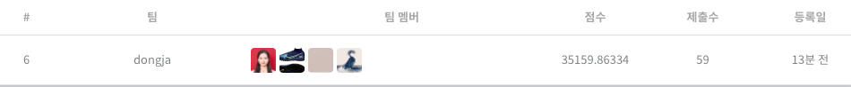

# 데이콘 비트 트레이더 경진대회 시즌2, bitTrader

# 목차

1. [프로젝트 설명](#프로젝트-설명)

   - 개요 및 목적
   - 개발 환경

2. [대회 설명](#대회-설명)

   - 대회 규칙
   - 대회 데이터

3. [학습 및 예측 과정](#학습-및-예측-과정)

   - [fbprophet](./fbprophet.ipynb)
   - [LSTM](./lstm.ipynb)
   - [LGBMRegressor](./lightgbm.ipynb)
   - [LinearRegression](./linear.ipynb)

4. [자동 매매 프로그램](#자동-매매-프로그램)

   - 설명
   - 동작 설명
   - 실행 방법

5. [프로젝트 후기](#프로젝트-후기)

## 프로젝트 설명

- 개요 및 목적

  - 부산대 AI빅데이터 융합인재 양성 과정(2020-11-23 ~ 2021-05-26)을 들으면서 우리가 어느정도 수준인지 실력을 검증하고 싶었고 과연 우리가 배운 내용으로 코인 가격을 예측할 수 있을까 하는 호기심에 파이널 프로젝트로 팀원들과 데이콘 비트 트레이더 경진대회 시즌2에 참가하게되었습니다.

    대회에서 가장 높은 성적을 내는 모델을 찾고, 그 모델을 실제 코인 거래에 적용하여 자동 매매 하는 서비스를 만드는 것이 목적이었고 public score 6위로 대회를 마감했습니다. 이 모델을 사용해 현재 시점(프로그램 동작 시점)으로부터 과거 1380분의 데이터를 통해 미래 15분의 데이터를 예측해 자동 매매하는 프로그램을 만들었습니다.
    

- 개발 환경
  - python 3.7.6
  - jupyter 1.0.0
  - numpy 1.19.5
  - pandas 1.2.3
  - scikit-learn 0.24.1
  - lightgbm 3.1.1
  - pyupbit 0.2.19

## 대회 설명

- 데이콘 사이트 참고: https://dacon.io/competitions/official/235712/data

- 대회 규칙

  - 23시간 동안 코인 하나의 분단위 특징 변화를 입력 받아 이후 2시간 동안 코인의 분 단위 open 가격(시가)의 움직임을 추론한다. 개별 샘플에 대해 현재 보유한 금액을 기준으로 매수 비율(0 ~ 1)과 매도 시점(0 ~ 119분)을 결정한다.
  - 

- 대회 데이터
  - 
  - 

## 학습 및 예측 과정

- 데이터 전처리 방법에 따라 시계열예측, 머신러닝, 딥러닝 모델을 학습시간이 짧은 순서대로 모두 적용 시켜 가장 적합한 데이터 전처리 방법과 모델을 찾으려고 했습니다.

  처음에는 어떤 모델을 사용하느냐에 집중했지만 대회를 진행하다보니 적절한 모델을 사용하는 것도 중요하지만 그 이전에 데이터를 어떻게 처리를 하느냐가 더 점수에 지대한 영향을 끼친다는 것을 알게 되어 데이터 전처리 4가지 방법에 대해 가장 좋은 성적을 냈던 모델에 대해 정리하였습니다.

  대회에서는 4번의 방법으로 가장 높은 public score(6위)를 얻을 수 있었습니다. 하지만 실제 코인 데이터에 대해서는 2번의 방온톨로지가스 코인 데이터에 대해 학습을 한 모델로 예측을 했습니다.

1. 시계열 예측

   - fbprophet

2. 테스트 데이터만으로 예측

   - LSTM

3. 모든 샘플의 시가를 학습 및 예측 x_train 데이터 (7661, 1380), y_train 데이터 (7661, 120), x_test 데이터 (535, 1380)의 형태 갖도록 전처리 후 학습 및 예측

   - Lightgbm

4. 각 샘플에 대하여 x_train 데이터가 (60, 1320), y_train 데이터가 (60, 2), x_test 데이터가 (60, 1320)의 형태를 갖도록 전처리 후 학습 및 예측

   - LinearRegression

## 자동 매매 프로그램

- 설명

  - 온톨로지가스 코인의 과거 116295분의 시가, 종가, 저가, 고가, 거래량 데이터를 불러와 x: (7661, 6, 1380), y: (7661, 15)로 전처리 후 학습한 모델을 사용했습니다.

  - 대회에서는 120분을 예측했으나 프로젝트 발표 시간상 과거 1380분의 데이터를 통해 미래 15분의 데이터 예측하도록 했습니다.

  - 대회에서는 위의 4번 방법이 가장 score가 높았으나 실제 코인 거래에서는 위의 방법으로 학습을 하였을 때 정확도가 가장 높았습니다. [web_moel.ipynb](./web_model.ipynb)

- 동작 설명

  1. 코인 심블을 입력 받는다 ex) KRW-BTC (원화-비트코인)
  2. '그래프 확인' 버튼 클릭시 해당 코인의 과거 1380분간의 데이터 그래프를 그린다.
  3. - '거래 시작' 버튼 클릭시 클릭 시점으로부터 해당 코인의 과거 1380분간의 데이터를 통해 미래 15분의 예측 그래프를 그린다
     - 거래 시작 시점의 금액보다 오를 것이라 예측 되면 전부 매수하고 가장 금액이 높을 것이랑 예측되는 시간에 전량 매도한다.
     - 거래 시작 시점의 금액보다 내릴 것이라 예측되면 매수하지 않는다
  4. 15분후 실제 그래프를 그린다.
     

- 실행 방법
  - web_model.ipynb 파일에서 access, secret 값을 변경 후 모델을 생성 및 저장한다
  - trade.py 파일에서 access, secret 값을 변경한다
  - 터미널에서 main.py 파일이 있는 경로로 이동 후 python main.py 명령 실행

## 프로젝트 후기

1. 프로젝트를 진행하면서 다양한 방법으로 데이터를 전처리하고 다양한 예측 모델들을 사용하면서 교육 과정간 배운 내용들을 다시 한번 익히는 시간을 가질 수 있었고 배우지 못했던 새로운 내용들을 더 습득할 수 있었습니다.

2. 한달 간의 프로젝트 기간동안 팀원들과 협업하는 과정을 배울 수 있었고 public 6위라는 나름대로 만족스러운 결과를 이뤄 자신감을 얻을 수 있었습니다.

3. 대회에서 제공하는 정량적 데이터(시가, 종가, 저가, 고가, 거래량 등)만 사용하다 보니 실제 코인을 예측할 때 한계가 있었습니다. 정량적 데이터에 정성적 데이터(해당 코인 관련 인사의 트위터, 해당 코인 관련 기사 등)를 더해서 학습 및 예측에 사용한다면 실제 코인 예측 정확성을 좀 더 높일 수 있을 것이라 생각합니다.
